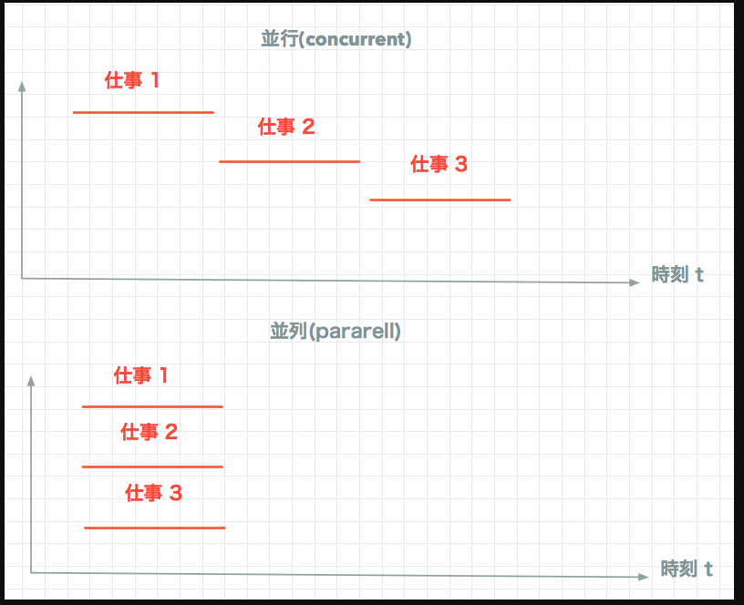

## 学び
- fork(2) システムコールによって、実行中のプロセスから新しいプロセスを生成できる。
  - 実行中のプロセスから新しいプロセスを生成できる。新しいプロセスは元のプロセスの完全なコピーとなる。
  - プロセス生成では、fork(2) を呼ぶ側のプロセスは「親プロセス」、新しく作られるプロセスは「子プロセス」と呼ばれる。
- 子プロセスは親プロセスで使われているすべてのメモリのコピーを引き継ぐ。親プロセスが開いているファイルディスクリプタも同様に引き継ぐ。
  - ちなみに、500MBのメモリを消費しているプロセスから fork(2) で新たにプロセスを生成した場合、合計 1GB のメモリが消費されることになる。
    - これをどんどん繰り返せば、あっという間にメモリを使い果たしてしまう。こうした現象を Fork 爆弾と呼んだりする。

## rubyでは？
- `Kernel#fork`が使える。
  - https://docs.ruby-lang.org/ja/latest/method/Kernel/m/fork.html
- 子プロセス側 では fork は nil を返す。
- 親プロセス側では fork は生成した子プロセスの pid が返る。
- 実用的に使うなら、以下のようにforkメソッドにブロックを引数として渡す。
```ruby
fork do
# 子プロセスで実行する処理をここに記述する
end

# 親プロセスで実行する処理をここに記述する
```

## 並行処理と並列処理の違い
- コンピュータの話で並行と並列というのは、CPUがどんな様子で仕事をするのか？で考える。
  - CPUのcoreが1つだけの場合、並列処理というのはありえない。



### 並行(concurrent)
- ある1つの時点では、1つの仕事しかしていないが、複数の仕事間を切り替えることによって、同時にやっているように見えること。
  - 速くするよりも、単純に同時にやることあるいは他を待たせないことが目的
### 並列(pararell)
- ある1つの時点で、実際に、物理的に、複数の仕事をしていること。
  - 速くすることが目的。

### 上記の手段
- マルチプロセス
- マルチスレッド

### 参考
- https://qiita.com/Kohei909Otsuka/items/26be74de803d195b37bd
- https://moro-archive.hatenablog.com/entry/2014/09/11/013520
